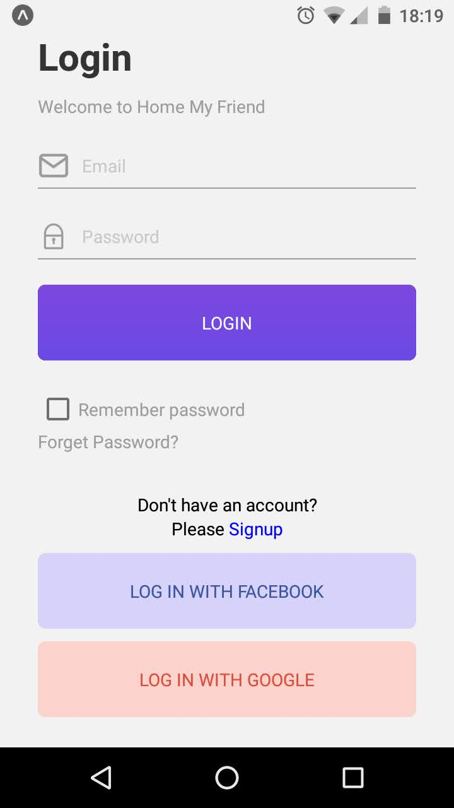

<h4 align="center">
  React Native Login Screen
</h4>

<p align="center">
  
</p>

<p align="center">
  
</p>

<p align="center">
  <a href="#tecnologies">Technology</a> &nbsp; &nbsp; | &nbsp; &nbsp;
  <a href="#project">Project</a> &nbsp; &nbsp; | &nbsp; &nbsp;
  <a href="#installation">Installation</a> &nbsp; &nbsp; | &nbsp; &nbsp;
  <a href="#license">License</a>
</p>

## Technologies

- [React](https://reactjs.org)
- [React Native](https://facebook.github.io/react-native/)
- [Expo](https://expo.io/)

## Project

[Design - Elegant IT Ltd.](https://dribbble.com/shots/6910175-Apps-Login-page-design)

## Installation

Use this command in the terminal

```
git clone https://github.com/craftsmaker/microsoft-alarm-clone.git
```

Enter in the resulted folder and use these commands:

```
yarn install
yarn start
```

ou

```
npm i
npm start
```

## License

This project is under MIT license.
